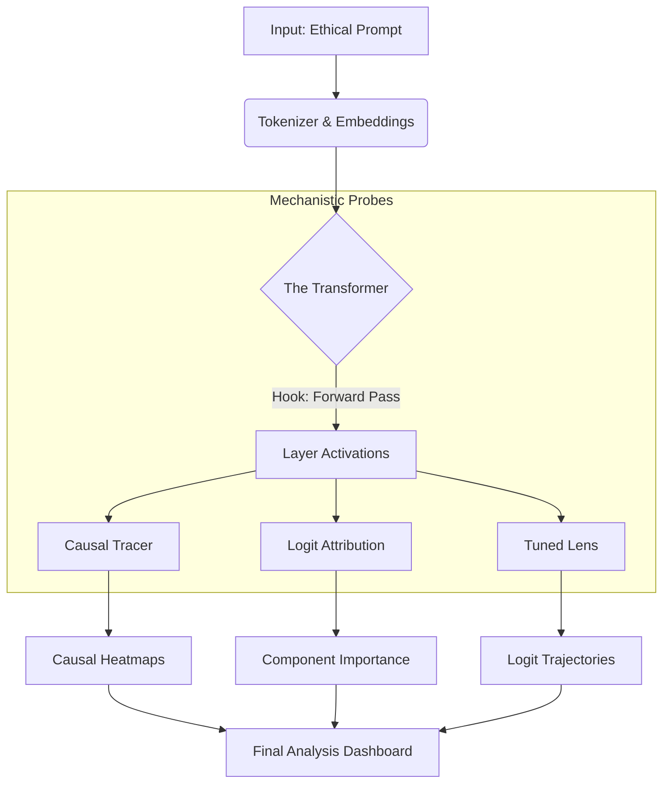

# 🧠 Do LLMs Have a Personality?
### *Deconstructing the Neural Circuitry of Ethical Decision Making*

[](https://www.python.org/)
[](https://pytorch.org/)
[](LICENSE)
[](https://github.com/yourusername/mechanistic-interpretability/graphs/commit-activity)

> *"We are not just asking **what** the model chooses. We are surgically opening the black box to ask **why**."*

---

## 🌌 Overview

**Do LLMs Have a Personality?** is not just a toolkit; it is an experimental framework designed to probe the cognitive substrates of Large Language Models. By leveraging state-of-the-art **Mechanistic Interpretability**, this project maps the flow of information through the "neural circuitry" of models like Llama-3 and GPT-2 as they process high-stakes ethical dilemmas.

We treat the Transformer architecture not as a monolith, but as a graph of causal mechanisms. This repository provides the scalpel to dissect them.

### 🔬 The Core Question
When an AI saves 5 people instead of 1 in a Trolley Problem, is it performing utilitarian calculus, or is it statistically mimicking human text? We answer this by tracking:
1.  **Localization:** Where does the decision happen?
2.  **Attribution:** Which attention heads force the decision?
3.  **Evolution:** How does the "thought" form layer-by-layer?

---

## ⚡ The Arsenal (Methodology)

We implement three powerful interpretability techniques, formalized below.

### 1. Causal Tracing (Intervention)
*Surgical activation patching to locate decisive layers.*

We measure the **Indirect Object Effect (IE)** by corrupting the input embeddings and restoring specific hidden states $h_i^{(l)}$ at layer $l$ to their "clean" values.

$$ \text{IE}_{layer}(l) = \mathbb{P}(y_{ethical} \mid h_i^{(l)*}) - \mathbb{P}(y_{ethical} \mid h_{corrupted}) $$

This reveals the specific layers that *cause* the model to switch its ethical stance.

### 2. Direct Logit Attribution (Decomposition)
*Unraveling the additive residual stream.*

The Transformer residual stream allows us to decompose the final logits $x_L$ into linear contributions from every Attention Head ($A$) and MLP block ($M$) across all layers ($L$):

$$ x_L = E + \sum_{i=0}^{L-1} A_i(x_i) + \sum_{i=0}^{L-1} M_i(x_i) $$

We project these vectors directly into the vocabulary space to see which specific component "shouted" the unethical choice.

### 3. The Tuned Lens (Trajectory Analysis)
*Eliciting latent predictions.*

Standard models only predict at the final layer. We utilize a trained affine probe (Tuned Lens) to decode the latent state $h_l$ at every intermediate layer, revealing the model's "stream of consciousness."

---

## 🛠️ Architecture

The framework is built for modularity and high-performance inference on consumer hardware.



---

## 🚀 Quick Start: The Lab Bench

### Prerequisites
- Python 3.9+
- A GPU with at least 8GB VRAM (for Llama-3 8B quantized) or a CPU for GPT-2.

### 1. Clone the Mainframe
```bash
git clone https://github.com/yourusername/mechanistic-interpretability.git
cd mechanistic-interpretability
pip install -r requirements.txt
```

### 2. Configure Credentials
Link your HuggingFace account to access gated models (like Llama-3).
```bash
cp config/models.json.template config/models.json
# Edit the file with your HF Token
```

### 3. Ignite the Analysis
Run the full pipeline on a single model. This script handles model loading, quantization (4-bit), and the triple-analysis suite.

```bash
python scripts/run_single_model.py --model llama --quantize 4bit
```

---

## 📊 Visualizing the Ghost

The `results/` directory will populate with high-definition visualizations. Here is how to read them:

### 📉 The Causal Trace Heatmap
* **X-Axis:** Token position (Subject, Verb, Object).
* **Y-Axis:** Network Layer (0 to $L$).
* **Insight:** A bright "hotspot" at Layer 15 on the "choice" token indicates the model "made up its mind" at that exact spatiotemporal point.

### 📊 The Attribution Spectrum
* **Bar Chart:** Positive bars push for Option A; negative bars push for Option B.
* **Insight:** If Attention Head 5:12 has a massive bar, that specific head is the "ethical driver."

### 📈 The Thought Trajectory
* **Line Graph:** Probability of "Save 5" vs "Save 1" across layers.
* **Insight:** Look for the "Cross-over Point"—the layer where the lines intersect is where the dilemma is resolved.

---

## 📂 Project Structure

```text
mechanistic-interpretability/
├── 📂 config/           # Model registry & secret keys
├── 📂 data/             # Base & Counterfactual Prompt Pairs
├── 📂 notebooks/        # Jupyter Labs for interactive probing
├── 📂 results/          # Generated artifacts (Heatmaps, CSVs)
├── 📂 src/
│   ├── 🧠 analysis/     # Core mathematical implementations
│   ├── 🤖 models/       # Wrappers for HF Transformers
│   ├── 🎨 visualization/# Plotting engines
│   └── 🔧 utils/        # Tokenization & metrics
└── 📜 scripts/          # CLI Entry points
```

---

## 🧪 Advanced Usage: Hacking the Matrix

### Custom Model Injection
Want to analyze a fine-tuned version of Mistral? Add it to `config/models.json`:

```json
"mistral-finetuned": {
    "name": "mistralai/Mistral-7B-Instruct-v0.2",
    "token": "hf_YourToken"
}
```

### Batch Processing via API
For large-scale evaluation of 1000+ prompts, use the batch processor with memory management:

```python
from src.analysis.causal_tracer import run_batch_causal_tracing
from src.models.registry import ModelRegistry

registry = ModelRegistry()
registry.load_model('llama', use_4bit=True)

# Run efficient batch processing
run_batch_causal_tracing(
    model_key='llama',
    prompts=big_list_of_prompts,
    registry=registry,
    batch_size=8
)
```

---

## 🤝 Contributing

We welcome fellow researchers and engineers! If you have a new interpretability technique (e.g., Sparse Autoencoders, Path Patching), or if you notice any bugs or see opportunities for improvement, please feel free to reach out or submit a PR. We are learning and building in parallel as master’s students, and your contributions are highly appreciated.

1. Fork the repo.
2. Create your feature branch (`git checkout -b feature/amazing-feature`).
3. Commit your changes.
4. Open a Pull Request.

---

## 📜 Citations & References

If you use this toolkit in your research, please cite the original interpretability papers:

> **Locating and Editing Factual Associations in GPT** (Meng et al., 2022)  
> **Transformer Feed-Forward Layers Are Key-Value Memories** (Geva et al., 2021)  
> **Eliciting Latent Predictions from Transformers** (Belrose et al., 2023)

---
